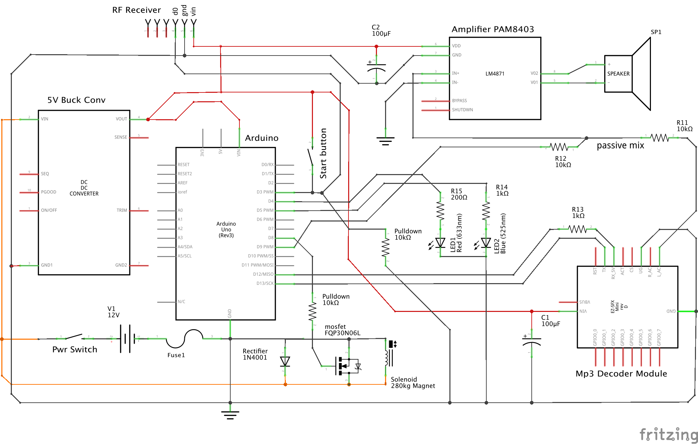

# RAD Gate
### RemoteArDuino BMX Gate Controller

This project is an Open Source gate controller for BMX gates. You will need to build the controller yourself.

Please see the [Change Log](CHANGELOG.md)

## Features

- spoken cadence
- random start
- remote control
- light tree
- Conforms to BMX Australia / UCI gate cadence


## Requirements

- Arduino based micro controller with 11 digital IO pins
  - This design has been proven to run on the Arduino Uno (both the Adafruit Metro, and Robotdyne Uno clones)
  - It also runs on the ESP8266, but you **will** need to change some of the pin references
- Soundboard, I recommend the JQ2500 model. The Adafruit SoundFX boards also work
- Amplifier module
- Trim pot (TBA: trimpot value)
- Diode (TBA: diode value)
- Resistors (TBA: add suggested values)
- Big fancy start button
- Enclosure of some sort
- Electro magnetic latch (I used a 280kg Ebay sourced magnet)
- 12v supply (can be power brick, or car/motorbike battery)
- (optional for light tree) NeoPixel stick (Adafruit or Banggood clone)
- (optional for remote control) remote module
  - any remote module will work, as long as it can trigger a signal on one of the input pins
- (optional) barrel jack and switch. You can omit these if you want to use the barrel jack on the Arduino, and let the unit switch on when plugged in

## Component Substitutions

- The MOSFET circuit (with diode, LED, and MOSFET) can be switched out for a MOSFET module, or relay module.
- The resistor values for the LEDs vary depending on your LED model and how bright you want it. Use a breadboard circuit to determine these.

## Current limitations

- When running from battery, there is no detection of low battery. This is a problem, because when charge gets too low, the gate drops. This may surprise the rider.

## Build

This project can be built using the Arduino IDE, or on the command line:

````
user@host$ make
````

## Schematic


