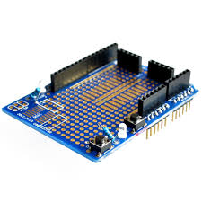
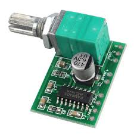
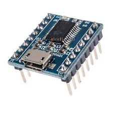
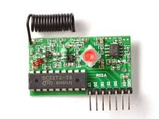

# Component List

| Part               | Notes |
| -------------------| ------------- |
| Arduino            | Uno suggested, but other Arduinos would work fine |
| Uno Proto shield   | *Only required if using Arduino Uno*    |
| Enclosure          | Anything is fine, as long as the arduino fits |
| Barrel Jack        | to plug in power adaptor |
| Button             | A big awesome looking start button |
| Class D Amplifier board | Suggest PAM8403 or similar    |
| Diode              | Schottky Diode - used to protect MOSFET circuit against reverse flow. 1N5822 or similar. |
| Fuse               | A polyfuse will give protection while automatically resetting. Other fuse types are fine, but need replacement on failure. You can omit this if you want to live dangerously. |
| JQ6500 Sound Board |  |
| LED Power          | |
| LED Magnet Status  | |
| LED Sequence Active| |
| N-Channel MOSFET   | FQP30N06L or similar |
| Power switch       | |
| Resistor LED Power | *Value depends on LED* |
| Resistor LED Magnet| *Value depends on LED* |
| Resistor LED Seq   | *Value depends on LED* |
| Resistor JQ6500    | If using the JQ6500, you need a 1k resistor between the TX pin and the Arduino |
| RF Receiver board  | 315Mhz or 450Mhz RF receiver (momentary). The board should be the type that sends a high signal out of one of the pins when a signal is received. I've had mixed success with models from Aliexpress. Some have a range of only 10cm, others work from 10 meters+ away. The Superheterodyne receivers generally have a much better range.    The Adafruit boards are known to work well. |
| RF Remote control  | Remote control compatible with the RF receiver board you select. |
| RBG LED Stick      | **For Light Tree** WS2812 5050 RGB LED stick (Adafruit Neopixel stick works too) |
| Trim pot           | W502 |

## Additional Components for DC Power

| Part               | Notes |
| -------------------| ------------- |
| DC Adaptor | A 12v DC adaptor supplying at least 1.5amps. You might have luck with a smaller supply, but if the unit has intermittent start up failures, you should get a more powerful supply.  |

## Additional Components for Battery Power

If running from battery, there is no charge circuit, and no low battery warning circuit.

| Part               | Notes |
| -------------------| ------------- |
| Alligator clips x2 | For battery connection |
| Barrel plug        | |
| Battery  (12v)     | Any 12v battery will do. I've successfully used a 12v motorbike battery. Li-ion would be far more compact, but far more likely to catch fire if you do something wrong. |
